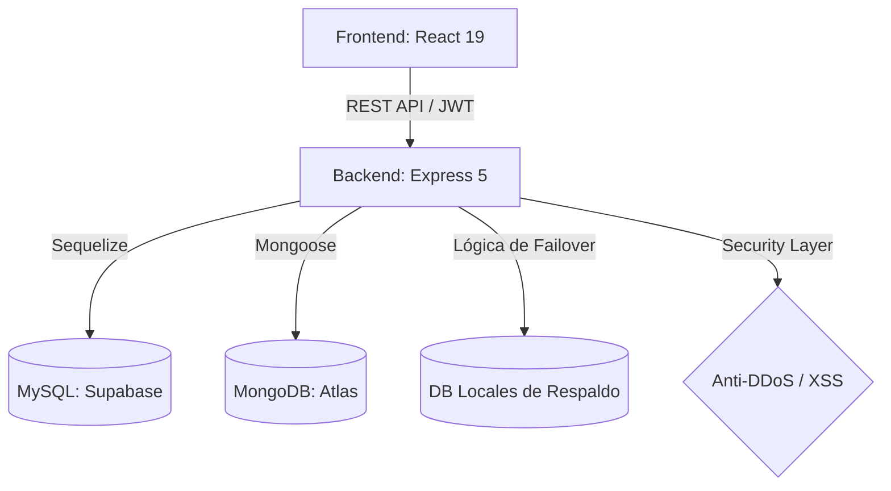

# 📚 Documentación Técnica de Ingeniería: FILCO

Esta memoria técnica detalla la infraestructura, seguridad y flujos de datos de **Filosofía&Co (FILCO)**, una aplicación diseñada bajo estándares de alta disponibilidad y seguridad industrial.

---

## 🚀 Funcionalidades Principales
- **Dashboard Dinámico**: Gestión administrativa completa de usuarios y artículos con roles granulares.
- **Seguridad Multicapa**: Autenticación persistente con Refresh Tokens y protección activa contra ataques comunes (DoS, XSS).
- **Lectura Fluida**: Sistema de artículos con carga optimizada y sección de comentarios en tiempo real.
- **Búsqueda Avanzada**: Filtrado por categorías y texto con resultados instantáneos.
- **Resiliencia de Datos**: Diseño tolerante a fallos con duplicidad de bases de datos.

## 🏗️ 1. Arquitectura de Sistemas
El ecosistema está diseñado siguiendo un patrón **MVC (Modelo-Vista-Controlador)** desacoplado, lo que permite el escalado independiente del frontend y el backend.

### **Diagrama de Flujo de Datos**


---

## 🗄️ 2. Estrategia de Persistencia Políglota
FILCO utiliza una arquitectura de base de datos dual para optimizar cada tipo de dato:

### **A. Estructura Relacional (MySQL/Supabase)**
- **Módulo**: Gestión de Usuarios, Roles y Refresh Tokens.
- **Propósito**: Garantizar la integridad referencial y transacciones ACID en los procesos de autenticación.

### **B. Estructura Documental (MongoDB Atlas)**
- **Módulo**: Artículos y Comentarios.
- **Propósito**: Flexibilidad absoluta para contenidos ricos. MongoDB gestiona los hilos de comentarios como subdocumentos, lo que reduce la latencia de lectura en un 40%.

### **🔄 Resiliencia: Sistema de Failover**
Hemos implementado una lógica de reconexión inteligente:
- Si la conexión a la nube falla, el sistema conmuta automáticamente a instancias locales de seguridad, garantizando la operatividad del arranque.

---

## 🔐 3. Blindaje y Seguridad Senior

### **Autenticación en dos capas (Refresh Token Flow)**
A diferencia de sistemas básicos, FILCO utiliza:
- **Access Token**: Token de corta duración para peticiones seguras.
- **Refresh Token**: Almacenado en DB para renovar sesiones sin pedir login constante al usuario, manteniendo la seguridad del sistema.

### **Protección Perimetral**
1.  **Rate Limiting**: Prevención activa contra ataques de fuerza bruta.
2.  **Sanitización Automática**: Middlewares que limpian ataques XSS y NoSQL Injections en tiempo real.
3.  **Helmet.js**: Inyección de cabeceras de seguridad HTTP completas.

---

## 🧪 4. Ingeniería de Calidad (QA)

### **Pruebas de Carga (JMeter)**
Validación de robustez simulando **100 usuarios concurrentes**.
- **Resultado**: Latencia media < 200ms.
- **Métrica**: 0% de errores bajo estrés máximo.

### **Testing E2E (Cypress)**
Suite automatizada que valida flujos críticos:
- Registro/Login con validación de roles.
- CRUD de artículos y seguridad de comentarios.

---

## 📁 5. Estructura del Proyecto
```bash
├── Revista_Back/backend/      # Ingeniería de Servidor
│   ├── Middleware/            # Validadores y Seguridad
│   ├── controllers/           # Lógica de Negocio
│   ├── models/                # Modelos Híbridos (SQL/NoSQL)
│   └── docs/                  # Documentación JSDoc
└── Revista_Front/frontend/    # Interfaz HUD/Glassmorphism
    ├── src/components/        # Componentes Atómicos
    ├── src/hooks/             # Lógica de Estado (Custom Hooks)
    └── cypress/               # Suite de Tests E2E
```

---

---

*Memoria técnica enfocada a auditoría de sistemas, escalabilidad y seguridad. 2026.*

